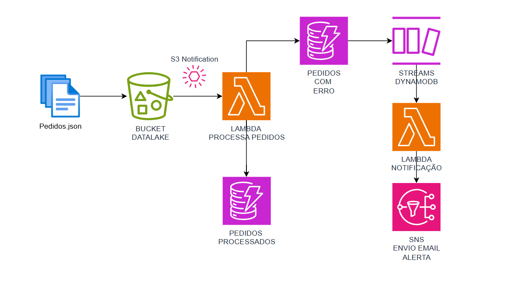

# Projeto AWS Lambda para Processar Pedidos e Tratamento de Pedidos Inválidos

## Descrição do Projeto
Este projeto consiste em uma função AWS Lambda que é acionada por notificações do S3 quando um arquivo JSON de pedidos é carregado. A função faz o seguinte:

1. Baixa o arquivo JSON do bucket S3.
2. Processa o conteúdo e insere os pedidos válidos em uma tabela DynamoDB.
3. Se um pedido for inválido, ele será enviado para uma fila SQS para tratamento posterior.

## Recursos Necessários

### 1. Bucket S3

Um bucket S3 será usado para armazenar os arquivos JSON de pedidos. Quando um novo arquivo é enviado, uma notificação S3 será acionada para chamar a função Lambda.

- **Nome do bucket**: Defina o nome do bucket S3 que será utilizado.
- **Notificação S3**: Configure uma notificação S3 para invocar a função Lambda sempre que um arquivo JSON for carregado.

Exemplo de política S3:

```
{
  "Version": "2012-10-17",
  "Statement": [
    {
      "Effect": "Allow",
      "Action": "s3:GetObject",
      "Resource": "arn:aws:s3:::NOME_DO_BUCKET/*"
    }
  ]
}
```

### 2. Tabela DynamoDB

A tabela DynamoDB será usada para armazenar os pedidos processados. Cada pedido contém as informações do cliente, status, e detalhes do pedido.

- **Nome da tabela**: `PedidosTable`
- **Chave de Partição**: `orderId` (String)
- **Chave de Ordenação**: `status` (String)

Exemplo de esquema da tabela:

| Atributo       | Tipo   | Chave         |
|----------------|--------|---------------|
| orderId        | String | Partition Key |
| status         | String | Sort Key      |
| customerName   | String |               |
| customerEmail  | String |               |
| totalAmount    | Number |               |
| orderDate      | String |               |

### 3. Fila SQS

Uma fila SQS será utilizada para armazenar os pedidos inválidos, que precisam ser analisados ou corrigidos.

- **Nome da fila SQS**: Defina o nome da fila SQS.
- **URL da fila SQS**: Substitua a URL na função Lambda pelo valor correto da sua fila.

Exemplo de política SQS:

```
{
  "Version": "2012-10-17",
  "Statement": [
    {
      "Effect": "Allow",
      "Action": "sqs:SendMessage",
      "Resource": "arn:aws:sqs:REGIAO:ID_DA_CONTA:NOME_DA_FILA"
    }
  ]
}
```

### 4. Função Lambda

A função Lambda será responsável por:

- Baixar o arquivo JSON do S3.
- Processar os pedidos válidos e inseri-los no DynamoDB.
- Enviar os pedidos inválidos para a fila SQS.

### Permissões Necessárias

A função Lambda precisa das seguintes permissões:

1. **Permissões S3**: Para ler os arquivos JSON do bucket S3.
2. **Permissões DynamoDB**: Para inserir itens na tabela DynamoDB.
3. **Permissões SQS**: Para enviar mensagens para a fila SQS em caso de erro.

Exemplo de política IAM:

```
{
  "Version": "2012-10-17",
  "Statement": [
    {
      "Effect": "Allow",
      "Action": [
        "s3:GetObject",
        "dynamodb:PutItem",
        "sqs:SendMessage"
      ],
      "Resource": [
        "arn:aws:s3:::NOME_DO_BUCKET/*",
        "arn:aws:dynamodb:REGIAO:ID_DA_CONTA:table/NOME_DA_TABELA",
        "arn:aws:sqs:REGIAO:ID_DA_CONTA:NOME_DA_FILA"
      ]
    }
  ]
}
```

### 5. Configuração do S3 Trigger

Adicione um evento de notificação ao bucket S3 para que a Lambda seja acionada quando novos arquivos forem enviados.

- **Evento**: `s3:ObjectCreated:Put`
- **Destino**: Função Lambda

***
